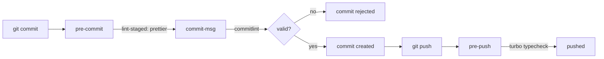

# Commit Conventions

Commit messages are load-bearing in this repository. They are not just history:
the version number, the `CHANGELOG.md` entry and the GitHub release notes are all
derived from them. A sloppy message produces a wrong version or an invisible
change.

## Structure

```text
<type>(<scope>): <short imperative summary>

[optional body]

[optional footer(s)]
```

A scope is **optional but strongly encouraged**. It renders in bold in the release
notes and tells a reader which workspace changed, so include one whenever the
change belongs to a particular package. Omit it only when a change genuinely spans
the whole repository. When present it must come from the enum below.

```text
feat(api): add health check endpoints

Implement /health/live and /health/ready using @nestjs/terminus. Readiness
fails first during shutdown so the load balancer stops routing before the
server closes.

Closes #42
```

## Three separate decisions

The same commit passes through three independent systems. Confusing them is the
usual source of "why didn't my change appear in the changelog?".

| Question                                      | Decided by                          |
| --------------------------------------------- | ----------------------------------- |
| Is this message **accepted**?                 | `commitlint.config.js`              |
| Does it **trigger a release**, at what level? | `releaseRules` in `.releaserc.json` |
| Does it **appear in the changelog**?          | the changelog preset (angular)      |

A commit can release without appearing in the notes, and can appear in the notes
without releasing. The table below gives the combined result.

## Types: release impact and changelog visibility

| Type       | Release   | Changelog section           |
| ---------- | --------- | --------------------------- |
| `feat`     | **minor** | Features                    |
| `fix`      | **patch** | Bug Fixes                   |
| `perf`     | **patch** | Performance Improvements    |
| `refactor` | **patch** | — _(only if breaking)_      |
| `revert`   | none¹     | Reverts                     |
| `docs`     | none      | — _(only if breaking)_      |
| `style`    | none      | — _(only if breaking)_      |
| `test`     | none      | — _(only if breaking)_      |
| `build`    | none      | — _(only if breaking)_      |
| `ci`       | none      | — _(only if breaking)_      |
| `chore`    | none      | **never**, even if breaking |

Plus one scope-based rule: **any commit scoped `deps`** releases a **patch**,
whatever its type. Dependency bumps ship as `chore(deps): ...` and still produce
a release.

¹ **`revert` is a trap.** Writing `revert(api): undo the thing` by hand releases
**nothing** — the default rule matches a parsed revert, not the literal type. The
message `git revert` generates on its own does release a patch:

```text
Revert "feat(api): add thing"

This reverts commit abc1234567890.
```

Both forms appear in the changelog under Reverts. So use `git revert` and keep
its message, rather than hand-writing a `revert:` commit, or the undo ships
without a version bump.

### Why most types are invisible

The angular changelog preset publishes `feat`, `fix`, `perf` and `revert`
unconditionally. Every other type is **discarded unless the commit declares a
breaking change** — and `chore` is discarded even then. This is the preset's
`transform`, not a setting we chose:

```js
// conventional-changelog-angular/src/writer.js
let discard = true
commit.notes.map((note) => {
  discard = false // any BREAKING CHANGE note keeps the commit
  ...
})
if (commit.type === "feat") type = "Features"
else if (commit.type === "fix") type = "Bug Fixes"
else if (commit.type === "perf") type = "Performance Improvements"
else if (commit.type === "revert" || commit.revert) type = "Reverts"
else if (discard) return undefined // ← docs, style, refactor, test, build, ci
```

The practical consequence: **if you want a change to be visible to users, it has
to be a `feat`, `fix` or `perf`.** Reaching for `chore` to avoid a version bump
also erases the change from the record.

### Breaking changes

A `BREAKING CHANGE:` footer, or a `!` after the type/scope, forces a **major**
bump regardless of type, and adds the commit to a `BREAKING CHANGES` section.

```text
ci(release)!: require node 22

BREAKING CHANGE: Node 22.14 or newer is now required.
```

This is why the `ci(release)` commit appears in the 1.0.0 notes while every
`docs` and `chore` commit does not.

## Scopes

| Scope       | Target               | Typical use                                        |
| ----------- | -------------------- | -------------------------------------------------- |
| `api`       | `apps/api`           | Controllers, services, modules, database schema    |
| `web`       | `apps/web`           | Pages, components, the API client, `proxy.ts`      |
| `ui`        | `packages/ui`        | Shared components and design tokens                |
| `contracts` | `packages/contracts` | Shared Zod schemas and inferred types              |
| `config`    | shared configs       | ESLint, TypeScript, Prettier, Tailwind, compose    |
| `deps`      | dependencies         | Upgrades and lockfile changes (**releases patch**) |
| `release`   | release tooling      | semantic-release config and workflow               |
| `repo`      | repository-wide      | Turbo, husky, root scripts, CI workflows           |

An unlisted scope is a hard failure. Add it to `scope-enum` in
`commitlint.config.js` before using it.

## What is actually enforced

Enforced by commitlint on `commit-msg` — an invalid message is rejected:

- a known type from the list above
- if a scope is given, that it is one from the enum (an unlisted scope fails)
- subject not empty, not capitalised, no trailing full stop
- header at most **100** characters
- a blank line before the body and before footers

Conventions **not** enforced, but expected in review:

- a scope whenever the change belongs to one workspace — nothing rejects
  `fix: correct the thing`, but it tells a reader nothing about where
- imperative mood — "add", not "added" or "adds"
- a header comfortably under ~72 characters, so `git log --oneline` stays readable
- one logical change per commit
- a body explaining **why**, when the reason is not obvious from the diff

## Hook workflow



Hooks are skipped in CI via `HUSKY=0`, so semantic-release's own release commit
is not linted against these rules.

## Examples

|     | Message                                               | Why                                             |
| :-: | ----------------------------------------------------- | ----------------------------------------------- |
| ✅  | `feat(api): add cursor pagination to user list`       | Releases minor, appears under Features          |
| ✅  | `fix(web): stop turbo racing typecheck against build` | Releases patch, appears under Bug Fixes         |
| ✅  | `chore(deps): upgrade clerk backend to v3`            | Releases patch via the `deps` scope rule        |
| ✅  | `docs(repo): document the release process`            | No release, absent from the changelog — correct |
| ❌  | `chore(api): add rate limiting`                       | A user-facing feature hidden as a chore         |
| ❌  | `feat(backend): add clerk guard`                      | `backend` is not in the scope enum              |
| ⚠️  | `feat: add clerk guard`                               | Accepted, but a scope would say where           |
| ❌  | `Fix(api): Added user route.`                         | Capitalised, past tense, trailing full stop     |

The first ❌ is the one worth internalising: choosing a type to dodge a version
bump also removes the change from the changelog. Pick the type that describes the
change, and let the tooling decide the version.

## Checking before you push

```bash
pnpm release:dry
```

Runs the real analysis over real history and prints the version and notes that
would be produced, without tagging or publishing anything.
