# Commit Message Strategy & Workflow

This document details the commit message conventions, Git hooks workflow, and best practices enforced in this monorepo.

---

## 🎯 Purpose & Strategy

We enforce **Conventional Commits**. Following a strict, structured commit convention allows us to:

1. **Automate Versioning & Changelogs**: Tooling like `semantic-release` (Phase 9) derives package version bumps and generates `CHANGELOG.md` automatically from commit types.
2. **Standardize Monorepo Scopes**: Clear scoping pinpoints changes to specific workspace packages (`apps/api`, `apps/web`, `packages/ui`, etc.).
3. **Streamline Code Review**: Clean, descriptive commits make git log traversal and code reviews fast and transparent.

---

## 🏗️ Commit Structure

Every commit message must follow this structure:

```text
<type>(<scope>): <short imperative summary>

[optional body]

[optional footer(s)]
```

### Example

```text
feat(api): add health check endpoints

Implement /health/live and /health/ready endpoints using @nestjs/terminus.

Closes #42
```

---

## 🏷️ Allowed Scopes & Types

### Allowed Scopes (`scope-enum`)

Commit messages **must** use one of the following validated workspace scopes:

| Scope       | Package / Target      | Example Use Cases                                  |
| :---------- | :-------------------- | :------------------------------------------------- |
| `api`       | `apps/api`            | Controllers, services, Nest modules, DB schemas    |
| `web`       | `apps/web`            | Next.js pages, components, client-side state       |
| `ui`        | `packages/ui`         | Shared UI components, Design System tokens         |
| `contracts` | `packages/contracts`  | Shared Zod schemas, API contracts, DTO types       |
| `config`    | `packages/*-config`   | ESLint, TypeScript, Tailwind, or workspace configs |
| `deps`      | Monorepo dependencies | Upgrading pnpm lockfile, root/package dependencies |
| `release`   | Release / Publishing  | Version tags, CHANGELOG updates, semantic-release  |

---

### Allowed Commit Types (`@commitlint/config-conventional`)

| Type       | Intent                                                        | Release Impact             |
| :--------- | :------------------------------------------------------------ | :------------------------- |
| `feat`     | A new feature for the user or system                          | Bumps **MINOR** (`v1.1.0`) |
| `fix`      | A bug fix                                                     | Bumps **PATCH** (`v1.0.1`) |
| `perf`     | A code change that improves performance                       | Bumps **PATCH** (`v1.0.1`) |
| `docs`     | Documentation changes only                                    | No release bump            |
| `style`    | Formatting, missing semi-colons, whitespace (no logic change) | No release bump            |
| `refactor` | Code restructuring without adding feature or fixing bug       | No release bump            |
| `test`     | Adding missing tests or correcting existing tests             | No release bump            |
| `build`    | Changes to build tools, Turbo configs, or dependencies        | No release bump            |
| `ci`       | CI workflow modifications (GitHub Actions, Docker builds)     | No release bump            |
| `chore`    | Maintenance tasks (husky hooks, repo cleanup)                 | No release bump            |

> 💥 **Breaking Changes**: Adding `BREAKING CHANGE:` in the commit footer (or `!` after type/scope, e.g., `feat(api)!: change user response shape`) triggers a **MAJOR** version bump (`v2.0.0`).

---

## ⚡ How the Git Workflow Works

When working in this repo, Git hooks manage code quality automatically:

```mermaid
flowchart LR
    A[git commit] --> B[pre-commit hook]
    B -->|runs| C[lint-staged: prettier]
    C --> D[commit-msg hook]
    D -->|runs| E[commitlint validation]
    E -->|passed| F[Commit Created]
    F --> G[git push]
    G --> H[pre-push hook]
    H -->|runs| I[turbo typecheck]
    I -->|passed| J[Pushed to Remote]
```



1. **Stage files & Commit**: You run `git commit -m "feat(web): add user avatar dropdown"`.
2. **Pre-commit (`lint-staged`)**: Automatically runs `prettier --write` on staged files.
3. **Commit-msg (`commitlint`)**: Validates commit message against conventional rules and scope enum (`[api, web, ui, contracts, config, deps, release]`). If invalid, the commit is rejected.
4. **Pre-push (`turbo typecheck`)**: Runs `pnpm turbo typecheck` across all packages before pushing to remote branch.

---

## ✅ Do's and ❌ Don'ts

### ✅ Do's

- **Use imperative mood in subject**: Write `add`, `fix`, `change` instead of `added`, `fixes`, `changing`.
- **Keep the title concise**: Keep header line under 72 characters.
- **Lower-case the subject**: Start short description with lowercase (e.g. `feat(api): add pino logger`).
- **One atomic logical change per commit**: Keep commits focused.

### ❌ Don'ts

- **Don't use unapproved scopes**: e.g., `feat(database): ...` ❌ (Use `feat(api): ...` or `feat(config): ...`).
- **Don't end subject with a period**: `feat(web): update button.` ❌
- **Don't commit non-conventional messages**: `wip`, `fixed bug`, `temp commit` ❌
- **Don't bypass hooks** with `--no-verify` unless in emergency hotfix situations.

---

## 📝 Good vs. Bad Examples

| Status | Commit Message                                         | Reason                                           |
| :----: | :----------------------------------------------------- | :----------------------------------------------- |
|   ✅   | `feat(api): implement pino logger module`              | Valid type, valid scope, imperative subject      |
|   ✅   | `fix(web): resolve hydration mismatch on theme toggle` | Valid type and scope, clear summary              |
|   ✅   | `docs(config): document commit message strategy`       | Valid type and scope                             |
|   ❌   | `added user auth`                                      | Missing type and scope                           |
|   ❌   | `feat(backend): add clerk guard`                       | Invalid scope (`backend` is not in allowed list) |
|   ❌   | `Fix(api): Added user route.`                          | Capitalized type & subject, ends with period     |
