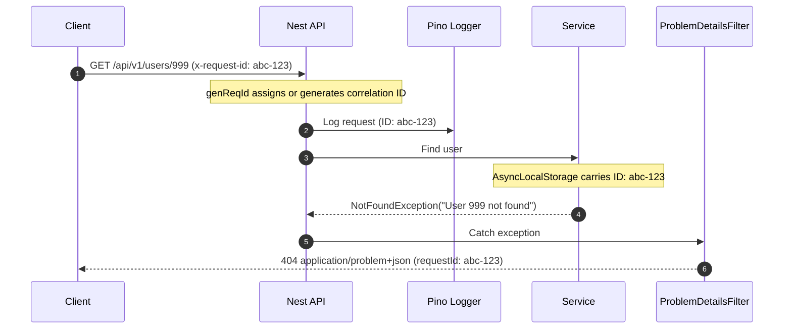

# Logging & Error Handling Guidelines

This document outlines the architecture, standards, and usage patterns for logging and error handling in the API (`apps/api`).

---

## 📐 Architecture Overview

Our backend architecture relies on two key standards for telemetry and fault management:

1. **Structured Pino Logging (`nestjs-pino`)**: All logs are emitted as structured JSON with correlation IDs (`x-request-id`) carried seamlessly across asynchronous calls via Node.js `AsyncLocalStorage`.
2. **RFC 7807 Problem Details (`application/problem+json`)**: All HTTP errors are formatted according to the RFC 7807 standard, providing machine-readable and predictable error contracts for clients.



---

## 🪵 Logging Guidelines

### 1. Ingesting & Injecting Logger in Services

Always inject the logger or instantiate Nest's `Logger` class with a context name:

```typescript
import { Injectable, Logger } from "@nestjs/common"

@Injectable()
export class UsersService {
  private readonly logger = new Logger(UsersService.name)

  async findOne(id: string) {
    this.logger.log(`Fetching user profile for id: ${id}`)
    // ...
  }
}
```

> 💡 **Correlation ID**: You do **not** need to manually append `requestId` to your log strings. Pino automatically attaches the request ID from `AsyncLocalStorage` to every log emitted during a request lifecycle.

---

### 2. Log Levels & Usage

Choose log levels deliberately based on environment and operational severity:

| Level   | Purpose                                                              | Example                                             |
| :------ | :------------------------------------------------------------------- | :-------------------------------------------------- |
| `fatal` | System crash, unrecoverable failures requiring immediate action      | Database pool connection failure at boot            |
| `error` | Unexpected runtime errors or caught exceptions needing investigation | Failed external API call, unhandled 500 error       |
| `warn`  | Expected operational anomalies or deprecated behavior                | Invalid login attempt, rate limit threshold reached |
| `info`  | Key state changes and milestone application events                   | User created, background job completed              |
| `debug` | Detailed operational information for troubleshooting                 | Query parameters, payload transformation details    |
| `trace` | Highly granular diagnostic traces                                    | Deep library execution hooks                        |

---

### 3. Correlation ID (`x-request-id`) Handling

- **Inbound Header**: If a request includes `x-request-id`, the API reuses it as the correlation ID.
- **Header Generation**: If missing, the API generates a UUIDv4.
- **Response Header**: The correlation ID is **always** echoed back in HTTP response headers as `x-request-id`.

---

### 4. Sensitive Data Redaction

Security rules automatically redact sensitive keys from all logs:

- `req.headers.authorization`
- `req.headers.cookie`
- `res.headers["set-cookie"]`
- Any property ending with or named `password`

> ⚠️ **Caution**: Avoid explicitly logging full request bodies or raw JWT tokens in log calls.

---

### 5. Health Check Exclusions

Requests targeting `/health*` routes are ignored by Pino HTTP auto-logging to prevent drown in monitoring logs.

---

## 🚨 Error Handling Guidelines (RFC 7807)

All API errors return `application/problem+json` response headers and adhere to the RFC 7807 specification.

### 1. Problem Details Schema

| Field       | Type     | Description                                                                      |
| :---------- | :------- | :------------------------------------------------------------------------------- |
| `type`      | `string` | URI reference identifying the problem type (e.g. `https://httpstatuses.com/404`) |
| `title`     | `string` | Short, human-readable status summary                                             |
| `status`    | `number` | HTTP status code                                                                 |
| `detail`    | `string` | Human-readable explanation specific to this occurrence                           |
| `instance`  | `string` | Request URI path where the error occurred                                        |
| `requestId` | `string` | Correlation ID for tracing logs                                                  |
| `timestamp` | `string` | ISO 8601 timestamp                                                               |
| `errors`    | `array`  | Optional array of detailed validation errors                                     |

---

### 2. Standard Exception Throwing

Throw standard NestJS HTTP exceptions in your controllers or services. The global `ProblemDetailsFilter` automatically maps them into RFC 7807 responses.

#### Example: Throwing NotFoundException

```typescript
import { Injectable, NotFoundException } from "@nestjs/common"

@Injectable()
export class UsersService {
  async findOne(id: string) {
    const user = await this.userRepo.findById(id)
    if (!user) {
      throw new NotFoundException(`User with ID ${id} was not found`)
    }
    return user
  }
}
```

#### Example: Client RFC 7807 Error Response

```json
{
  "type": "https://httpstatuses.com/404",
  "title": "Not Found",
  "status": 404,
  "detail": "User with ID usr_123 was not found",
  "instance": "/api/v1/users/usr_123",
  "requestId": "c7a8b12f-93d4-4f2a-b620-8e102f4d1e21",
  "timestamp": "2026-08-10T12:40:00.000Z"
}
```

---

### 3. Handling Unhandled Errors

If an unexpected exception occurs (e.g., database connection loss or NullPointer), `ProblemDetailsFilter`:

1. Logs the full stack trace securely at `error` level.
2. Returns a safe `500 Internal Server Error` response **without leaking stack traces** to the client.

```json
{
  "type": "https://httpstatuses.com/500",
  "title": "Internal Server Error",
  "status": 500,
  "detail": "An unexpected error occurred",
  "instance": "/api/v1/checkout",
  "requestId": "e4f1a2b3-c5d6-7e8f-9a0b-1c2d3e4f5a6b",
  "timestamp": "2026-08-10T12:40:00.000Z"
}
```
